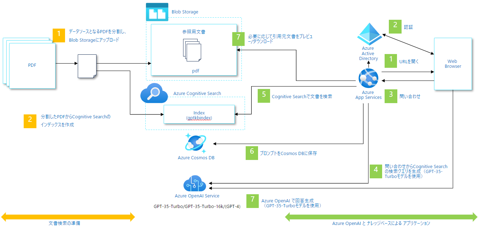
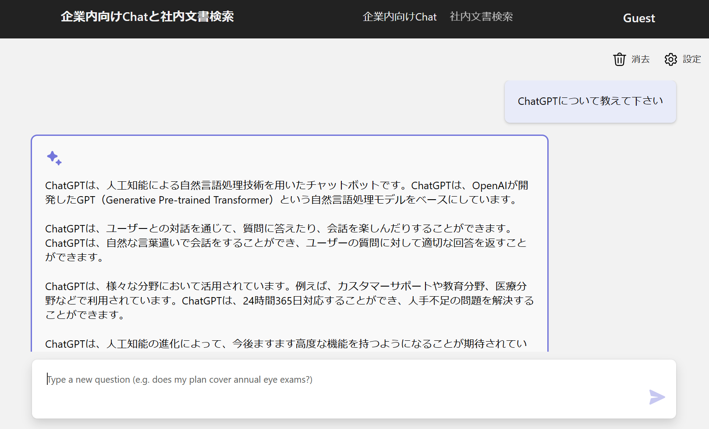

# AI Chat + 社内文書検索

## 概要
このデモは、ChatGPT ライクなインターフェースを使用して企業の社内文書を検索するアプリケーションの実装パターンです。デモアプリを利用するためには、Azure Open AI の ChatGPT(gpt-35-turbo) モデルと、Azure Cognitive Search、他にいくつかのリソースの作成が必要です。

このリポジトリでは、サンプルデータに[厚生労働省のモデル就業規則](https://www.mhlw.go.jp/stf/seisakunitsuite/bunya/koyou_roudou/roudoukijun/zigyonushi/model/index.html)を使用しています。

デモアプリは以下のように動作します。

## Architecture

## UI

### ナレッジベース設計
#### Azure Search Indexの作成・更新方法
本サンプルでは、`data/`ディレクトリにあるデータを、`scripts`にあるスクリプトでAzureにアップロードし、Azure Search Indexを作成する方法をとっています。Indexの更新のしやすさや検索結果の改善をする場合、サンプルのスクリプトを部分的に修正するのではなく、要件を整理した上で更新用のアプリケーション構築の用意等についての検討を推奨します。

#### 検索結果の「良さ」や「精度」改善するための設計
生成AIは確率的な性質を持つため、同じ入力に対しても異なる出力が生成される可能性があります。このような性質は、生成AIが多様な出力を生成できる利点でもありますが、一方で評価が難しくなる場合もあります。そのため、生成AIの「良さ」や「精度」を一様に評価するのは困難であり、用途や目的に応じて評価基準が設定されることが多いです。

生成AIの「良さ」や「精度」を一様に評価するのは困難ではありますが、以下の様なことを考慮すると、エンドユーザの検索結果に対する満足度を高めることができる可能性があります。
- **PDFファイルの分割方法**: 本サンプルでは与えられたPDFを機械的にページ単位で分割していますが。PDFファイルの分割方法の改善することにより検索結果の良さを高めることができる可能性があります。
- **画像・複雑な図表・PDF以外のファイルフォーマットの扱い**: 本サンプルはPDFファイルの扱いを前提としており、画像や複雑な図表を検索結果で活用することはできません。画像・複雑な図表・PDF以外のファイルフォーマットの扱いも重要なユースケースの場合、ナレッジベース設計を見直す必要がある可能性があります。
- **各モデルの最大トークン数による制約**: 本サンプルの文書検索の結果から返答を作成する過程において、最大トークン数の制約から文書の1024トークンのみを利用しています。この制約により、文書の内容を十分に活用できていない可能性があります。この制約を緩和することにより、検索結果の精度を高めることができる可能性があります。